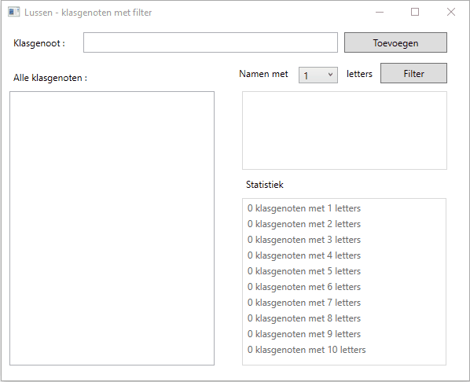

# Oefening lussen : klasgenoten met filter

Bekijk aandachtig onderstaand filmpje zodat je snapt wat de bedoeling van het project is.  
Tijdens het opstarten vul je cmbCharacters op met getallen van 1 tot en met 10.  
Je dient 2 lists bij te houden die in alle methoden beschikbaar zijn :  
  * classMates = lijst met alle ingevoerde namen dit telkens dient bijgewerkt te worden wanneer op "btnAdd" wordt geklikt (en de ingevoerde naam niet leeg is)  
  * filterResult = lijst met alle ingevoerde namen wiens lengte even lang is als de lengte die werd geselecteerd in "cmbCharacters"  
Je bouwt ook voortdurend een statistiek op (lstStats) : je geeft per naamlengte op hoeveel namen er zijn.  

Plaats zo veel als mogelijk in afzonderlijke methoden.  

